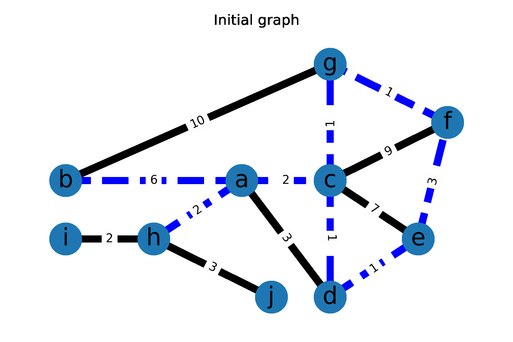
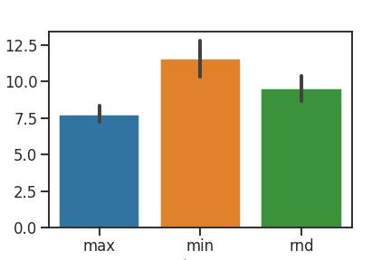
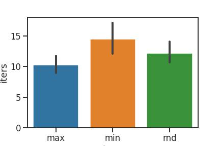
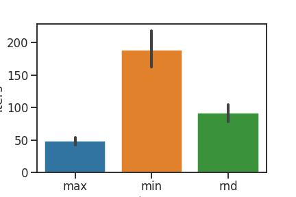

# Area Coverage

## Описание

Проект, реализующий алгоритмы покрытия области.

### Пример

Разными цветами отмечены области, на которые декомпозирована карта и отдельно выделены препятствия. Пусть показан линией, последнее положение - красной точкой.


## Установка

```bash
git clone https://github.com/pogrebnoijak/area-coverage
```

После этого появится `area-coverage/coverage.ipynb` - достаточно запустить его как обычный `jupyter notebook`.

## Запуск

### Входные данные

Есть класс `Map`, он принимает файлы формата [movingai](https://movingai.com/benchmarks/formats.html). Полученный инстанс впоследствии можно использовать для запуска алгоритмов.

Помимо этого данные могут иметь вид `List[List[int]]`, где стоят `1` в занятых клетках, а во всех остальных - `0`. В таком виде можно тоже передать карту для покрытия.

Например, так выглядит структура карты из примера выше.

```python
mapa = [
        [0, 0, 0, 0, 0, 0, 0, 0, 0, 0],
        [0, 0, 0, 0, 0, 0, 0, 0, 0, 0],
        [0, 0, 1, 1, 0, 0, 0, 0, 0, 0],
        [0, 0, 1, 1, 0, 0, 0, 1, 1, 1],
        [0, 0, 0, 0, 0, 0, 0, 1, 1, 0],
        [0, 0, 0, 0, 0, 0, 0, 1, 0, 0],
        [0, 0, 0, 0, 0, 0, 0, 0, 0, 0],
    ]
```

Так же есть генератор карт - `generate_cells`. Она принимает размеры карты и часть которая будет покрыта препятствиями. Так же есть `random_state` для повторяемости результата.

### Запуск

Пусть у нас есть карта `mapa`, полученная любым из выше описанных способов.

Тогда получить путь можно запустив `cover(mapa)`.

Эта функция имеет несколько дополнительных необязательных (но очень полезных) аргументов:

`decompositor_type` - тип декомпозиции, применяемый для карты. Реализованы `TrapezoidalMapDecomposition` и `BoustrophedonMapDecomposition`.

`area_type` - тип карты (каждая декомпозированая часть покрывается соответсвующим алгоритмом). Реализованы `ZigZagArea`, `SpiralSTCArea`, `ScanSTCArea`.

`show` - надо ли рисовать карту после нахождения покрывающего пути.

`debug` - надо ли перерисовывать карту после каждого шага. (глобальная переменная `DEBUG_SLEEP` - время ожидания после каждого шага).

`start` - начальная позиция на карте. Если не задана выбирается автоматически.

`cover` возвращает путь - `List[Tuple[int, int]]` - последовательные позиции на карте.
 
## Алгоритмы

Декомпозиция: `Trapezoidal decomposition, Boustrophedon decomposition`

Алгоритм, задающий порядок обхода `node` графа декомпозиции: жадный статический (строится до обхода), жадный динамический (строится во время обхода, на выбор следующей `node` влияет текущая позиция).

Покрытие: `zig-zag, SpiralSTCArea, ScanSTCArea` (последние два работают при условии, что карта состоит из клеток `2x2` вместо `1x1`, при этом могут работать без декомпозиции)

## Картинки, примеры

Пример в начале покрыт `Boustrophedon decomposition + zig-zag`

### `Trapezoidal decomposition + zig-zag` выглядит так


### Случайная карта `100 x 100`


### [NewYork_0_1024](https://movingai.com/benchmarks/street/index.html) из `movingai`

(слишком мелко, для путей, но можно увидеть разные декомпозиции).

- Trapezoidal decomposition


- Boustrophedon decomposition


### Карта из примера с `debug=True` в `coverage`


### Spiral STC


### Scan STC


## Использованные материалы

- A Survey on Coverage Path Planning for Robotics
- Competitive on-line coverage of grid environments by a mobile robot

# Graph Coverage

## Описание

Проект, реализующий алгоритм решения [Rural Postman Problem](https://www.sciencedirect.com/science/article/abs/pii/030505489400070O), и проводящий серию экспериментов для оценки эффективности различных эвристик для алгоритма.

### Пример

Алгоритм определяет оптимальное множество опциональных ребер для построения цикла, проходящего по всем ребрам, и строит этот самый цикл. Ниже можно увидеть пример работы алгоритма. Обязательные ребра нарисованы черным, опциональные — синим.



## Установка

```bash
git clone https://github.com/pogrebnoijak/area-coverage
```

После этого появится `area-coverage/graph-coverage.ipynb` - достаточно запустить его как обычный `jupyter notebook`.

## Алгоритмы

Реализованы алгоритмы для решения задач CPP и RPP, описанные в [Xu, L.: 2011, Graph Planning for Environmental Coverage,
  Chapter 4; PhD thesis; Carnegie Mellon University.](https://www.ri.cmu.edu/pub_files/2011/8/thesis_xu.pdf#chapter.4).

Для запуска алгоритма нужно передать ему [NetworkX](https://networkx.org/) граф (`networkx.Graph` или `networkx.MultiGraph`). Параметр `get_otp` отвечает за то, какая эвристика будет использоваться для определения порядка перебора. С помощью параметра `return_stats = True` можно получить статистику запуска.

## Анализ производительности

Здесь проводится сравнение трех эвристик, определяющих порядок перебора путей:
1. выбор пути максимального веса на каждом шаге (`max`),
1. выбор пути минимального веса на каждом шаге (`min`),
1. выбор случайного пути на каждом шаге (`rnd`).

Ниже для разных эвристик приведены точечные графики зависимости количества итераций поиска от количества перебираемых путей. Данные для эвристик `max`, `min` и `rnd` нарисованы синим, оранжевым и зеленым цветами соответственно.

Также для каждой эвристики есть график со средним количеством итераций на данном тесте и 95-процентным доверительным интервалом.

### road-chesapeake


### road-grid


### road-random


### grid-8




### grid-random




### plan-1


### plan-2




## Использованные материалы

- [Xu, L.: 2011, Graph Planning for Environmental Coverage,
  Chapter 4; PhD thesis; Carnegie Mellon University.](https://www.ri.cmu.edu/pub_files/2011/8/thesis_xu.pdf#chapter.4)
